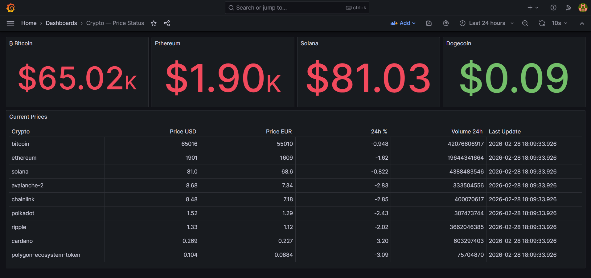
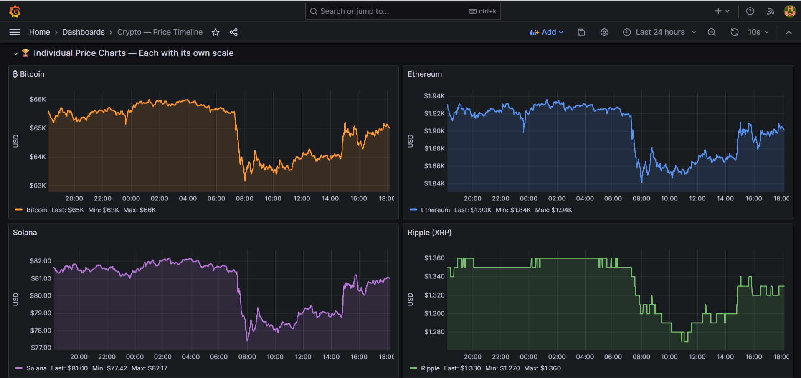
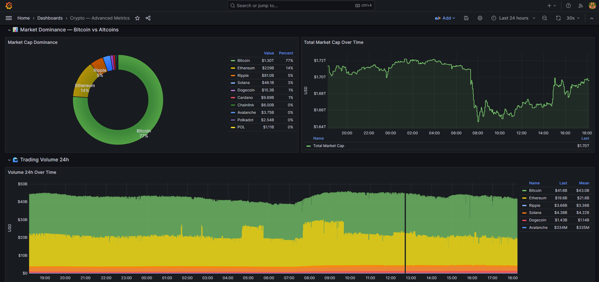

# Crypto Streaming Pipeline

Real-time cryptocurrency price monitoring system built with Apache Kafka, PostgreSQL, and Grafana.


## What this is

A data engineering project that streams live cryptocurrency prices every 30 seconds from the CoinGecko API into a PostgreSQL database, with real-time Grafana dashboards for visualization.

Built to learn and demonstrate the core patterns of real-time data pipelines: message queuing, stream processing, fault tolerance, and observability.

```
CoinGecko API → Producer → Kafka → Processor → PostgreSQL → Grafana
```

## Architecture

```
┌──────────────┐     ┌─────────────┐     ┌─────────────┐     ┌─────────────┐     ┌─────────────┐
│  CoinGecko   │────▶│  Producer   │────▶│    Kafka    │────▶│  Processor  │────▶│ PostgreSQL  │
│     API      │     │  (Python)   │     │   Broker    │     │  (Python)   │     │  Database   │
└──────────────┘     └─────────────┘     └─────────────┘     └─────────────┘     └──────┬──────┘
                                                                                         │
                                                                                         ▼
                                                                                  ┌─────────────┐
                                                                                  │   Grafana   │
                                                                                  │  Dashboards │
                                                                                  └─────────────┘
```

**Producer** — polls the CoinGecko API every 30 seconds for 10 cryptocurrencies and publishes each price update as a Kafka message, using the `crypto_id` as the message key to guarantee ordering per coin.

**Kafka** — acts as a buffer between producer and processor. Decouples ingestion from storage, so a slow database write never causes data loss.

**Processor** — consumes messages in batches and writes to PostgreSQL using a single `execute_values` INSERT per batch (one round-trip instead of ten).

**PostgreSQL** — stores all historical prices with indexes on `(crypto_id, timestamp DESC)` for efficient Grafana queries.

**Grafana** — three dashboards: current prices, price timelines, and advanced metrics (volatility, market dominance, volume analysis).

## Technical decisions worth noting

**Manual Kafka offset commit** — the processor uses `enable_auto_commit=False` and only commits the Kafka offset *after* a successful PostgreSQL INSERT. With auto-commit enabled, a crash between the Kafka commit and the DB write would silently lose data forever. The manual approach guarantees at-least-once delivery: if the process dies mid-write, Kafka re-delivers those messages on restart.

```python
# Order matters — Kafka commit only happens if INSERT succeeded
inserted = self.db_client.insert_batch(self.batch)   # 1. PostgreSQL commits
self.kafka_consumer.commit()                          # 2. Kafka advances offset
```

**Batch inserts with `execute_values`** — instead of 10 individual INSERTs per cycle, the processor accumulates messages and flushes them in a single query. One database round-trip instead of ten.

**`crypto_id` as Kafka message key** — ensures all messages for the same cryptocurrency always go to the same partition, preserving chronological order per coin.

**Retry logic on startup** — both producer and processor retry connection to Kafka and PostgreSQL with configurable intervals. In Docker Compose, services start in parallel and Kafka/PostgreSQL take longer to initialize than the Python services.

## Stack

| Component | Technology |
|-----------|------------|
| Producer / Processor | Python 3.11 |
| Message broker | Apache Kafka (Confluent 7.5.0) |
| Cluster coordination | Zookeeper (Confluent 7.5.0) |
| Database | PostgreSQL (Bitnami 15) |
| Visualization | Grafana OSS 10.2.0 |
| Containerization | Docker Compose |
| Testing | pytest + pytest-mock + responses |

## Prerequisites

- [Docker Desktop](https://www.docker.com/products/docker-desktop/) v20.10+
- Git

## Quick start

```bash
# 1. Clone
git clone https://github.com/RobertoRodriguezSolano/crypto-streaming-pipeline.git
cd crypto-streaming-pipeline

# 2. Configure environment
cp .env.example .env
# Edit .env if you want to change any defaults

# 3. Start everything
docker-compose up -d --build

# 4. Check it's running
docker-compose ps
docker logs -f crypto_producer
```

| Service | URL | Default credentials |
|---------|-----|---------------------|
| Grafana | http://localhost:3000 | admin / admin123 |
| PostgreSQL | localhost:5432 | crypto_user / crypto_pass |
| Kafka | localhost:29092 | — |

## Configuration

Copy `.env.example` to `.env` and adjust as needed:

```env
# PostgreSQL
POSTGRES_USER=crypto_user
POSTGRES_PASSWORD=crypto_pass
POSTGRES_DB=crypto_db
POSTGRES_PORT=5432

# Kafka
KAFKA_BOOTSTRAP_SERVERS=kafka:9092
KAFKA_TOPIC=crypto_prices
KAFKA_GROUP_ID=crypto_processor_group

# Producer
API_INTERVAL_SECONDS=30
MAX_RETRIES=10
RETRY_INTERVAL=5

# Processor
BATCH_SIZE=10
BATCH_TIMEOUT_SECONDS=5

# Grafana
GRAFANA_ADMIN_USER=admin
GRAFANA_ADMIN_PASSWORD=admin123
```

## Running tests

```bash
# Producer tests (22 tests)
docker-compose -f docker-compose.test.yml run --rm test-producer

# Processor tests (26 tests - includes manual commit guarantee tests)
docker-compose -f docker-compose.test.yml run --rm test-processor
```

The test suite covers the critical path of the at-least-once delivery guarantee — specifically that the Kafka offset commit does not happen when a database insert fails:

```
test_flush_batch_commits_kafka_after_successful_insert   PASSED
test_flush_batch_does_not_commit_kafka_on_db_failure     PASSED
```

| Component | Tests | Coverage |
|-----------|-------|----------|
| Producer | 22 | ~65% |
| Processor | 26 | 72% |

The uncovered lines are the `while True` main loop and startup banner — intentionally untested.

## Grafana setup

### 1. Configure the data source

Go to `http://localhost:3000` and log in with `admin / admin123`.

Navigate to **Connections → Data sources → Add data source → PostgreSQL** and fill in:

| Field | Value |
|-------|-------|
| Host | `postgres:5432` |
| Database | `crypto_db` |
| User | `crypto_user` |
| Password | `crypto_pass` |
| TLS/SSL Mode | `disable` |

Click **Save & Test** — it should return "Database Connection OK".

### 2. Import the dashboards

The three dashboard JSON files are in `grafana/dashboards/`. Import each one via **Dashboards → New → Import → Upload JSON file**.

| File | Dashboard |
|------|-----------|
| `1-crypto-status-dasboard.json` | Current prices stat panels and comparison table |
| `2-crypto-timeline-dashboard.json` | Price history per cryptocurrency |
| `3-crypto-metrics-dashboard.json` | Advanced metrics and analytics |

### Dashboard 1 — Current Prices

Stat panels showing the latest price for Bitcoin, Ethereum, Solana, and Dogecoin, plus a full table comparing all 10 cryptocurrencies by price, 24h change, volume, and market cap.



### Dashboard 2 — Price Timeline

Individual price chart per cryptocurrency, each with its own Y-axis scale so Dogecoin at $0.09 is as readable as Bitcoin at $64K. Also includes a normalized view where all coins start at 0% to compare relative performance regardless of absolute price, and a 24h change % panel for all coins on a shared axis centered at zero.



### Dashboard 3 — Advanced Metrics

- Market ranking table with Vol/MCap ratio (volume as a percentage of market cap — high values signal unusual trading activity)
- Market cap dominance donut showing Bitcoin vs altcoins share
- Total market cap over time
- 24h trading volume over time per coin
- Volatility ranking using coefficient of variation — normalizes by price so coins at different scales are directly comparable
- Rolling volatility with a 10-sample sliding window to see volatility evolving over time
- Relative performance chart showing % change from the start of the selected time window



## Project structure

```
crypto-streaming/
├── .env.example
├── .gitignore
├── docker-compose.yml
├── docker-compose.test.yml
├── init-db/
│   └── 01-init.sql
├── producer/
│   ├── Dockerfile
│   ├── requirements.txt
│   ├── producer.py
│   └── tests/
│       ├── conftest.py
│       └── test_producer.py
├── processor/
│   ├── Dockerfile
│   ├── requirements.txt
│   ├── processor.py
│   └── tests/
│       ├── conftest.py
│       └── test_processor.py
└── grafana/
    ├── dashboards/
    ├── screenshots/
    └── provisioning/
```

## Useful commands

```bash
# Rebuild and restart a single service after code changes
docker-compose up -d --build producer

# Query the database directly
docker exec postgres psql -U crypto_user -d crypto_db \
  -c "SELECT crypto_id, price_usd, timestamp FROM latest_prices ORDER BY market_cap_usd DESC;"

# Watch Kafka messages in real time
docker exec kafka kafka-console-consumer \
  --bootstrap-server kafka:9092 \
  --topic crypto_prices

# Backup the database before stopping
docker exec postgres pg_dump -U crypto_user crypto_db > backup.sql

# Stop without losing data (volumes are preserved)
docker-compose down

# Stop AND delete all data
docker-compose down -v
```

## Troubleshooting

**`NoBrokersAvailable` on producer/processor startup**
Kafka takes ~30 seconds to be ready. Both services retry automatically — check `docker-compose ps` and wait until Kafka shows `healthy`.

**No data for a cryptocurrency**
CoinGecko IDs are not always the coin symbol or common name. For example, Polygon's token is `polygon-ecosystem-token`, not `polygon` or `matic-network` (MATIC was migrated to POL in September 2024). Verify IDs at `https://api.coingecko.com/api/v3/coins/list`.

**`docker-compose down -v` deleted my data**
The `-v` flag removes named volumes including `postgres_data`. Always use `docker-compose down` without flags to preserve data.

## License

MIT License

Copyright (c) 2026 Roberto Rodriguez Solano